<div align="center">


<h1>DR Orchestration Toolkit</h1>

<p><strong>The Enterprise Standard for Industrialized Resilience and Multi-Cloud Recovery</strong></p>

[]()
[]()
[]()
[]()

<br/>

> **"Resilience is not a project; it's a capability."** 
> DR Orchestration Toolkit is a flagship repository designed to enable organizations to design, automate, and govern disaster recovery across multi-cloud and hybrid estates through industrialized runbook orchestration and validation.

</div>

---

## 🏛️ Executive Summary

**DR Orchestration Toolkit** is a flagship repository designed for Chief Technology Officers (CTOs), SRE Teams, and Resilience Leaders. In an era of increasing ransomware threats and cloud outages, the ability to orchestrate a rapid and reliable recovery is the ultimate survival mechanism.

This platform provides an industrialized approach to **Resilience**, delivering production-ready **DR Runbook Automation**, **Application Dependency Mapping**, **Cross-Region Failover**, and **RPO/RTO Governance Scorecards**. It supports **Azure**, **AWS**, **GCP**, and **Kubernetes**, enabling organizations to transition from "Manual Restoration" to "Automated Resilience."

---

## 💡 Why Disaster Recovery Matters

Recovery is the last line of defense against catastrophic failure:
- **Business Continuity**: Ensuring critical services remain available during major infrastructure outages or regional disasters.
- **Ransomware Defense**: Providing immutable recovery paths to restore operations after a security breach.
- **Regulatory Compliance**: Meeting institutional requirements for resilience testing and evidence generation.
- **Customer Trust**: Maintaining a reliable digital presence, even in the face of unexpected disruptions.

---

## 🚀 Business Outcomes

### 🎯 Strategic Resilience Impact
- **Reduced Recovery Time (RTO)**: Transitioning from manual, error-prone restores to automated, orchestrated failovers.
- **Minimizing Data Loss (RPO)**: Automating the validation of replication health and backup integrity.
- **Continuous Validation**: Moving from "once a year" DR drills to "continuous" resilience testing (Chaos DR).
- **Executive Visibility**: Providing real-time readiness scores and risk heatmaps to senior leadership.

---

## 🏗️ Technical Stack

| Layer | Technology | Rationale |
|---|---|---|
| **Orchestration Engine** | Python, Ansible, Terraform | High-performance execution of complex recovery runbooks and failover workflows. |
| **Control Plane** | FastAPI | High-performance API for request management and recovery orchestration. |
| **Frontend** | React 18, Vite | Premium portal for executive dashboards, runbook centers, and risk heatmaps. |
| **IaC Foundation** | Terraform | Multi-cloud infrastructure consistency and resilience foundation automation. |
| **Database** | PostgreSQL | Centralized repository for runbook state, application dependencies, and history. |
| **Observability** | Prometheus / Grafana | Real-time monitoring of replication health, drill pass rates, and system readiness. |

---

## 📐 Architecture Storytelling: 70+ Diagrams

### 1. Executive High-Level Architecture
The holistic vision of the enterprise resilience journey.

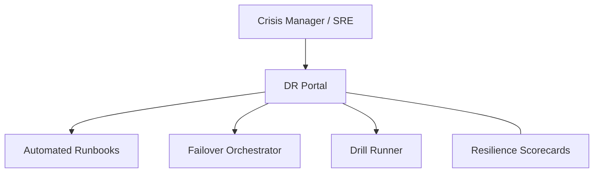

### 2. Detailed Component Topology
The internal service boundaries and management layers of the platform.

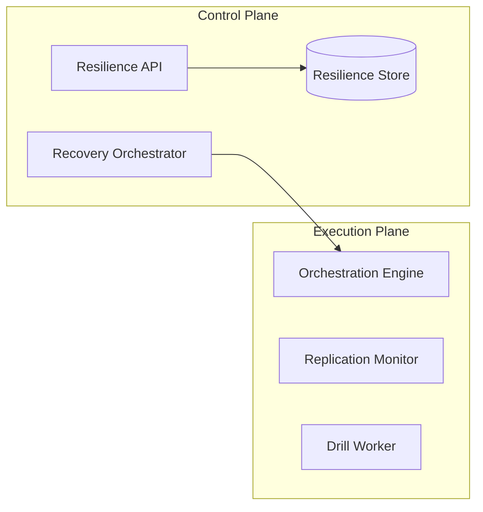

### 3. User to Control Plane Request Path
Tracing a failover command through the industrialized resilience stack.

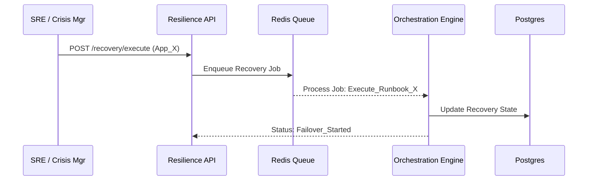

### 4. DR Orchestration Control Plane
The "Brain" of the framework managing global recovery definitions.

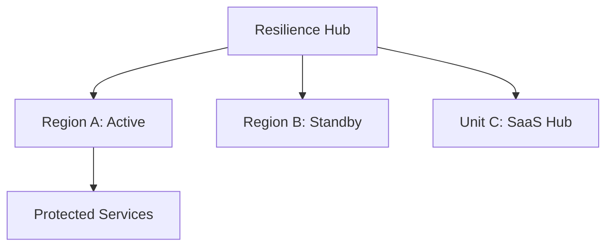

### 5. Multi-Cloud Topology
Synchronizing recovery standards across Azure, AWS, and GCP.

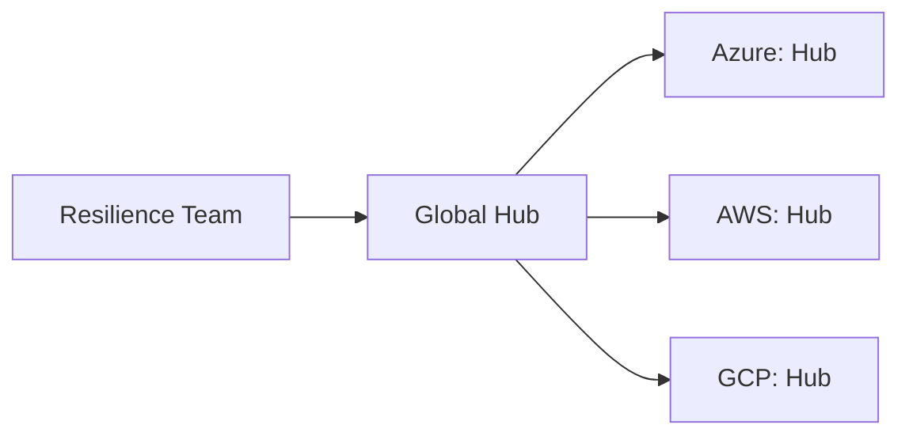

### 6. Regional Deployment Model
Hosting orchestration workers close to the recovery targets for reliability.

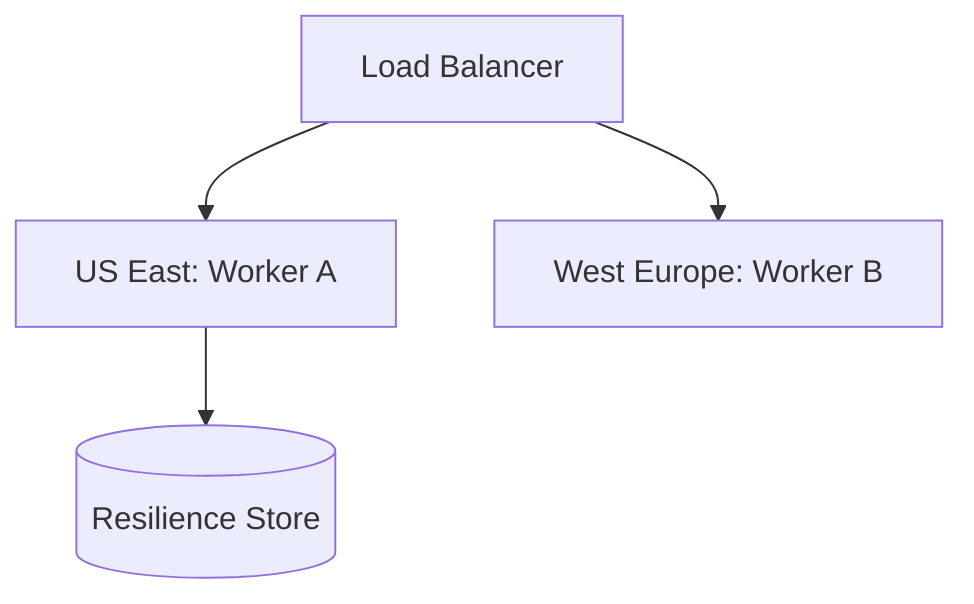

### 7. DR Failover Model
Ensuring platform continuity for the recovery hub itself.

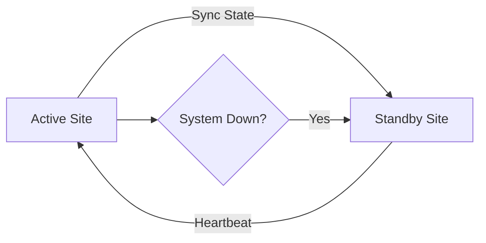

### 8. API Gateway Architecture
Securing and throttling the entry point for recovery orchestration.

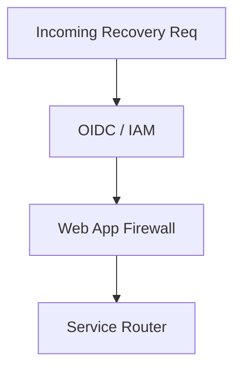

### 9. Queue Worker Architecture
Managing long-running restore and validation tasks at scale.

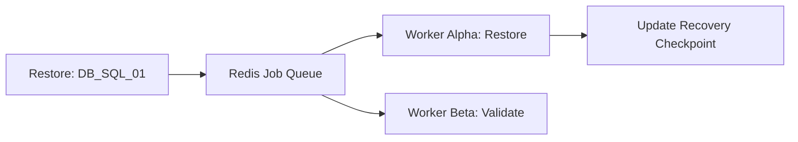

### 10. Dashboard Analytics Flow
How raw recovery logs become executive readiness scorecards.

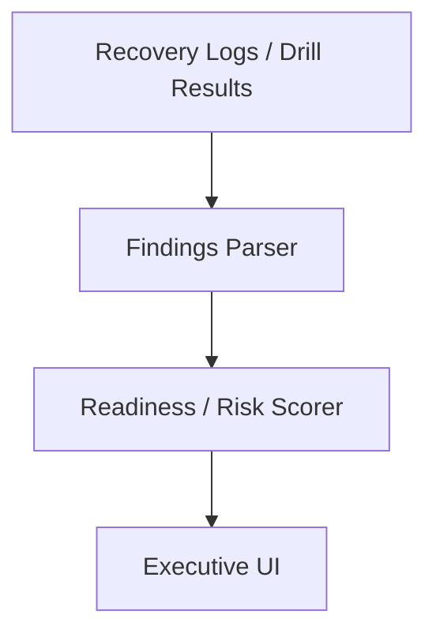

### 11. Active-Passive Failover Model
The classic DR pattern where a standby site is activated during a failure.

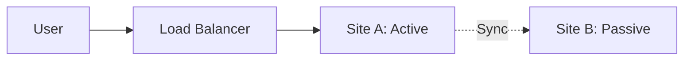

### 12. Active-Active DR Topology
Distributing traffic across multiple sites for zero-downtime resilience.

```mermaid
graph TD
    LB[Global Balancer] --> SiteA[Site A: Active]
    LB --> SiteB[Site B: Active]
    SiteA <->|Bi-Sync| SiteB
```

### 13. Warm Standby Pattern
Maintaining a scaled-down but ready-to-scale environment in the standby site.

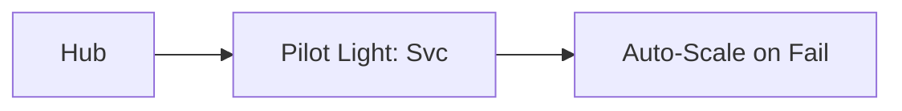

### 14. Cold Standby Pattern
Recovering from scratch using backups and IaC in a clean environment.

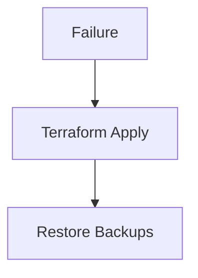

### 15. DNS Traffic Failover Workflow
Rerouting users to the recovery site using DNS record updates.

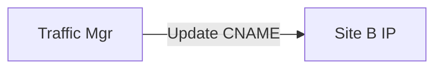

### 16. Global Load Balancer Failover
Automatically shifting traffic at the edge based on health checks.

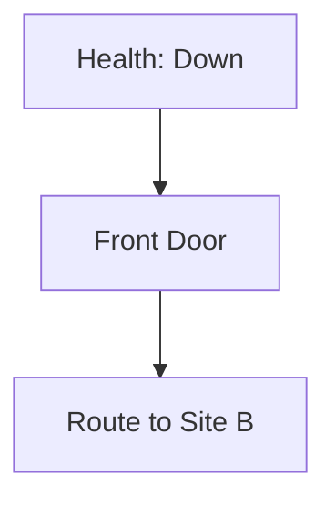

### 17. Application Tier Recovery Order
Orchestrating the sequence of service restarts to satisfy dependencies.

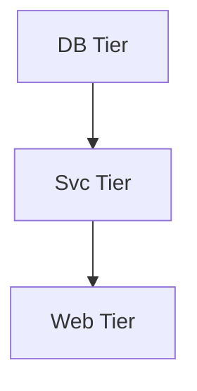

### 18. Database-First Restore Workflow
Prioritizing the data layer before application services can start.


### 19. Storage Replication Model
Ensuring data availability across geographic regions through asynchronous sync.

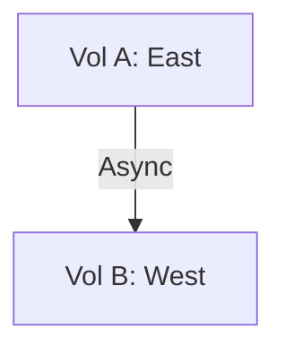

### 20. Service Mesh Failover Flow
Managing cross-cluster traffic routing through a unified service mesh.

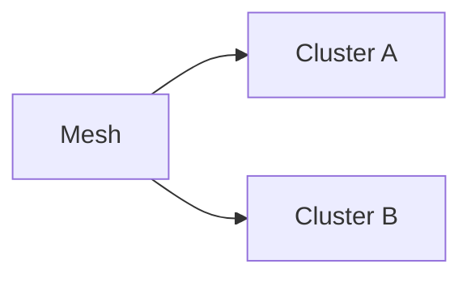

### 21. Snapshot Recovery Lifecycle
Restoring infrastructure state from point-in-time cloud snapshots.

```mermaid
graph TD
    Snap[Snap_v1] --> Disk[Create Disk]
    Disk --> Mount[Mount to VM]
```

### 22. PITR Restore Workflow
Recovering databases to a specific millisecond using transaction logs.

```mermaid
graph LR
    Full[Full Backup] --> Logs[Apply Logs] --> Ready[PITR Ready]
```

### 23. Immutable Backup Vault Model
Protecting recovery data from modification or deletion (ransomware defense).

```mermaid
graph TD
    Write[Write] --> Lock[WORM Lock]
```

### 24. Air-Gapped Recovery Pattern
Physically or logically isolating recovery data from the primary network.

```mermaid
graph LR
    NetA[Primary] ---|Offline| NetB[Vault]
```

### 25. Ransomware Recovery Flow
Identifying the last-known-good (LKG) clean state for restoration.

```mermaid
graph TD
    Scan[Malware Scan] --> LKG[Verified Clean]
```

### 26. Cross-Region Backup Copy
Distributing backup copies across cloud regions for geographic resilience.

```mermaid
graph LR
    Source[East US] --> Target[West US]
```

### 27. Backup Verification Model
Automatically validating that backups are restorable and uncorrupted.

```mermaid
graph TD
    Test[Restore Test] --> Check[Data Integrity]
```

### 28. Restore Testing Workflow
Running scheduled, automated restore tests in isolated environments.

```mermaid
graph LR
    Sched[Sched] --> Worker[Test Restore]
```

### 29. Archive Retrieval Lifecycle
Retrieving historical data from cold storage for compliance or legal requests.

```mermaid
graph TD
    Req[Req] --> Thaw[Hydrate] --> Data[Data]
```

### 30. Retention Governance Flow
Managing the lifecycle and deletion of aged recovery data.

```mermaid
graph LR
    Age[Age > 7yr] --> Delete[Purge]
```

### 31. AKS DR Model
Regional failover for Azure Kubernetes Service using Velero or backup sets.

```mermaid
graph TD
    ClusterA[A] --> Backup[Blob] --> ClusterB[B]
```

### 32. EKS DR Model
Orchestrating Kubernetes recovery across AWS regions.

```mermaid
graph LR
    EKS_A[EKS A] --> S3[Backup] --> EKS_B[EKS B]
```

### 33. GKE DR Model
Maintaining cluster state across Google Cloud regions.

```mermaid
graph TD
    GKE_A[GKE A] --> GCS[Backup] --> GKE_B[GKE B]
```

### 34. Multi-Cluster Failover
Shifting Kubernetes workloads between clusters during an outage.

```mermaid
graph LR
    Traffic[Traffic] --> ClusterA[A: Down]
    Traffic --> ClusterB[B: Up]
```

### 35. Terraform Rebuild Workflow
Using Infrastructure as Code to reconstruct the environment in a new region.

```mermaid
graph TD
    State[State] --> Apply[Plan & Apply]
```

### 36. Secret Restoration Flow
Recovering sensitive keys and credentials from a secure backup vault.

```mermaid
graph LR
    Vault[Vault] -->|Restore| K8s[K8s Secrets]
```

### 37. Ingress Recovery Model
Re-establishing public access paths in the recovery environment.

```mermaid
graph TD
    IP[New IP] --> DNS[Update A-Record]
```

### 38. Persistent Volume Migration
Moving stateful data between Kubernetes clusters or regions.

```mermaid
graph LR
    VolA[Vol A] --> Sync[Data Sync] --> VolB[Vol B]
```

### 39. Namespace Recovery Lifecycle
Recovering specific business applications within a Kubernetes cluster.

```mermaid
graph TD
    NS[Namespace] --> Objects[Deployments/Svcs]
```

### 40. Cluster Bootstrap Model
The automated sequence of provisioning a new cluster for recovery.

```mermaid
graph LR
    VPC[VPC] --> K8s[K8s] --> Addons[Add-ons]
```

### 41. Scheduled DR Drill Workflow
Automating the execution of regular, non-disruptive recovery tests.

```mermaid
graph LR
    Trigger[Monthly] --> Run[Execute Drill]
```

### 42. Tabletop Exercise Model
Simulating disaster scenarios for people and process validation.

```mermaid
graph TD
    Scenario[Outage] --> Response[Team Action]
```

### 43. Recovery Time Measurement
Calculating the actual RTO achieved during a drill or incident.

```mermaid
graph LR
    Start[Down] --> End[Up] --> Calc[Duration]
```

### 44. Dependency Validation Flow
Verifying that all upstream and downstream dependencies are available.

```mermaid
graph TD
    SvcA[Svc A] --> Check[Status: 200]
```

### 45. Communication Escalation Model
The hierarchy of notifications during a disaster event.

```mermaid
graph LR
    SRE[SRE] --> VP[VP Eng] --> CISO[CISO]
```

### 46. Incident Command Structure
Defining roles and responsibilities during recovery operations.

```mermaid
graph TD
    IC[Incident Lead] --> Ops[Ops Lead]
```

### 47. Metrics Pipeline
Monitoring the performance of recovery orchestration itself.

```mermaid
graph LR
    Engine[Engine] --> Prom[Prometheus]
```

### 48. Logging Architecture
Centralized and tamper-proof logging of all recovery actions.

```mermaid
graph TD
    Action[Failover] --> Audit[Audit Log]
```

### 49. Tracing Model
Tracing distributed recovery steps across cloud providers.

```mermaid
graph LR
    Hub[Hub] --> Cloud[AWS/AZ/GCP]
```

### 50. Capacity Planning Workflow
Ensuring the recovery environment has sufficient resources to host production.

```mermaid
graph TD
    Usage[Prod Load] --> Plan[Reserve Quota]
```

### 51. Executive KPI Review Cycle
Reporting resilience posture and drill results to leadership.

```mermaid
graph LR
    Stats[Stats] --> Deck[Executive Deck]
```

### 52. RPO Scorecard Workflow
Visualizing data loss risk across the application portfolio.

```mermaid
graph TD
    Target[15m] vs Actual[22m: Risk]
```

### 53. RTO Heatmap Model
Mapping recovery time capabilities across business units.

```mermaid
graph LR
    High[Unit A: 1h] --- Low[Unit B: 24h]
```

### 54. Criticality Tier Model
Prioritizing recovery efforts based on business impact tiers.

```mermaid
graph TD
    Tier0[Mission Critical] --> Tier1[Essential]
```

### 55. Budget Prioritization Workflow
Aligning resilience spend with business criticality.

```mermaid
graph LR
    Tier0[Tier 0] --> Spend[High Res]
```

### 56. Regulatory Evidence Model
Generating documentation required for compliance audits (SOC2/ISO).

```mermaid
graph TD
    Drill[Drill] --> Evidence[Report PDF]
```

### 57. Vendor Continuity Workflow
Assessing and monitoring the resilience of 3rd party providers.

```mermaid
graph LR
    SaaS[SaaS Provider] --> SLA[Review SLA]
```

### 58. Board Reporting Cadence
The strategic review of enterprise resilience at the board level.

```mermaid
graph TD
    Q1[Posturer] --> Q2[Drill Review]
```

### 59. Resilience Maturity Roadmap
The journey from manual backups to industrialized orchestration.

```mermaid
graph LR
    Manual[Manual] --> Auto[Automated]
```

### 60. Quarterly Review Cycle
Aligning resilience goals and runbook updates for the next 90 days.

```mermaid
graph TD
    Audit[Audit] --> Update[Update Runbooks]
```

### 61. OIDC / SSO Auth Flow
Securing the resilience platform with enterprise identity.

```mermaid
graph LR
    User[SRE] --> Entra[Azure AD]
```

### 62. RBAC Model
Defining granular permissions for recovery operators and auditors.

```mermaid
graph TD
    Role[Operator] --> Action[Execute Failover]
```

### 63. Secrets Management Flow
Securing the keys to the kingdom (recovery credentials).

```mermaid
graph LR
    App[App] --> KV[Key Vault]
```

### 64. Audit Logging Architecture
Centralized and immutable logs for all platform interactions.

```mermaid
graph TD
    Req[Req] --> Log[Loki/Elastic]
```

### 65. Change Governance Workflow
Governing updates to recovery runbooks through peer review.

```mermaid
graph LR
    Edit[Edit] --> PR[Peer Review] --> Approve[Approve]
```

### 66. Release Pipeline Validation
Validating that new software releases don't break recovery runbooks.

```mermaid
graph TD
    CI[CI/CD] --> Test[DR Dry Run]
```

### 67. Chaos Recovery Model
Injecting failures to validate the robustness of recovery orchestration.

```mermaid
graph LR
    Chaos[Kill VM] --> Recovery[Auto-Detect]
```

### 68. AI Readiness Scoring Flow
Using machine learning to predict recovery success based on historical data.

```mermaid
graph TD
    Data[Historical] --> ML[Model] --> Score[Score: 94%]
```

### 69. Global Operating Model
Operating the resilience platform across multiple time zones and teams.

```mermaid
graph LR
    US[US Team] --> EU[EU Team]
```

### 70. Continuous Improvement Loop
The ultimate feedback cycle for resilience excellence.

```mermaid
graph LR
    Measure[Measure] --> Improve[Improve]
    Improve --> Measure
```

---

## 🛡️ Resilience Methodology

### 1. The Resilience Pillars
Our platform is built on four core pillars:
- **Design**: Architecting applications for high availability and recoverability.
- **Automation**: Eliminating manual steps through industrialized runbook orchestration.
- **Validation**: Proving recovery capabilities through continuous drill testing.
- **Governance**: Quantifying risks and measuring performance against RPO/RTO targets.

### 2. Backup vs. HA vs. DR
- **Backup**: Data preservation for long-term retention and historical recovery.
- **High Availability (HA)**: Real-time redundancy for local component failures.
- **Disaster Recovery (DR)**: Geographic failover for catastrophic site or regional loss.

---

## 🚦 Getting Started

### 1. Prerequisites
- **Terraform** (v1.5+).
- **Docker Desktop**.
- **Kubernetes Cluster** (local or cloud).
- **Cloud CLI** (az, aws, or gcloud).

### 2. Local Setup
```bash
# Clone the repository
git clone https://github.com/Devopstrio/dr-orchestration-toolkit.git
cd dr-orchestration-toolkit

# Start the Resilience Control Plane
docker-compose up --build
```
Access the Dashboard at `http://localhost:3000`.

---

## 🛡️ Governance & Security
- **Immutability**: All recovery data is stored in write-once-read-many (WORM) vaults.
- **Isolation**: Recovery orchestration is isolated from the primary production environment.
- **Zero-Trust**: Platform access is strictly governed through OIDC and RBAC.

---
<sub>&copy; 2026 Devopstrio &mdash; Engineering the Future of Industrialized Resilience.</sub>
