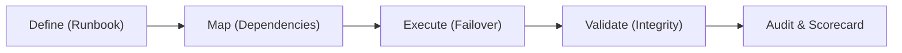
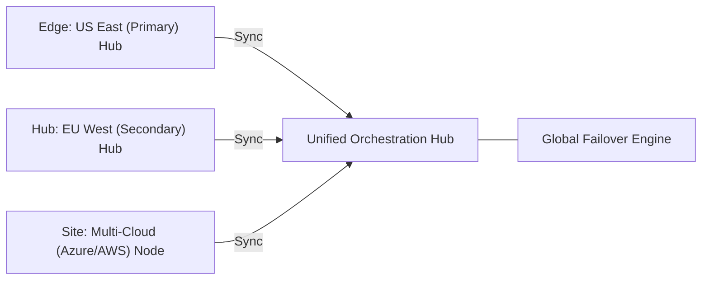
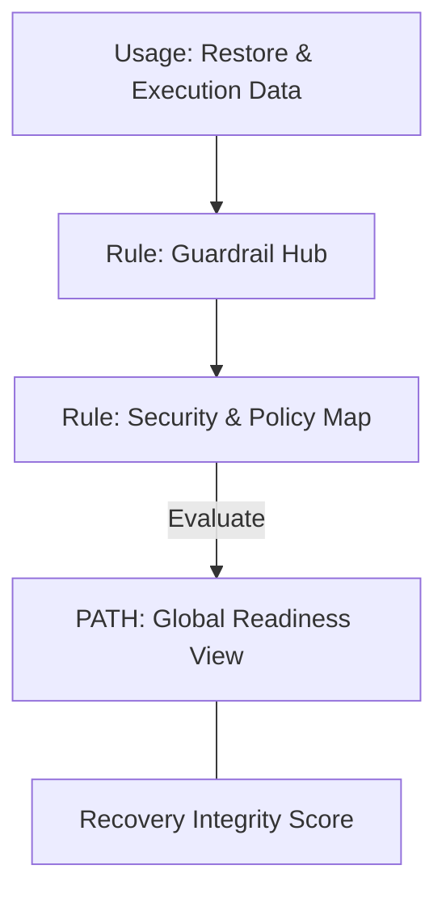
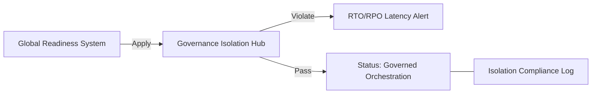
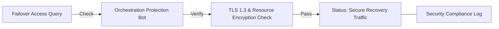
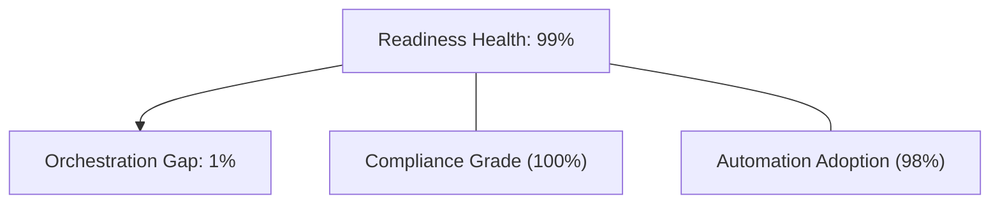
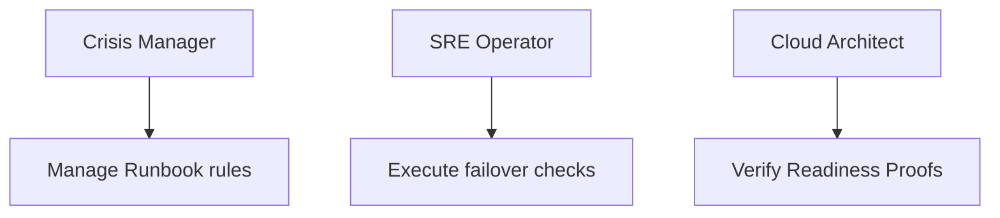
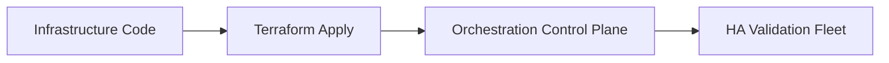
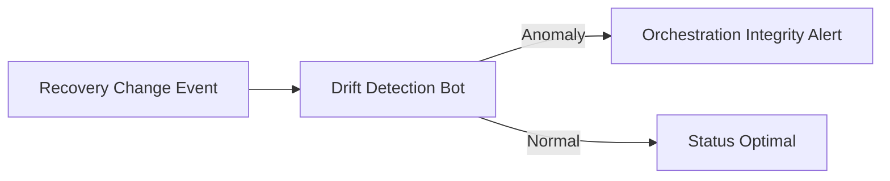
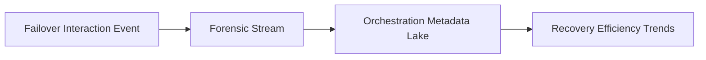

<div align="center">


<h1>DR Orchestration Toolkit</h1>

<p><strong>The Institutional-Grade Platform for Standardized Resilience Foundations, DR Execution Governance, and Multi-Cloud Failover Ecosystem Delivery.</strong></p>

[]()
[]()
[]()

<br/>

> **"Industrializing recovery delivery to automate resilience foundations."** 
> **DR Orchestration Toolkit** is an enterprise-grade platform designed to provide a secure, measurable, and highly automated foundation for global disaster recovery operations. It orchestrates the complex lifecycle of resilience—from runbook design and dependency mapping to failover execution and unified readiness auditing.

</div>

---

## 🏛️ Executive Summary

Fragmented recovery silos and manual failover workflows are strategic operational liabilities; lack of centralized orchestration is a primary barrier to organizational cloud maturity. Organizations fail to maintain a secure resilience foundation not because of a lack of backups, but because of fragmented execution standards, lack of automated recovery validation, and an inability to orchestrate DR planes with operational precision.

This platform provides the **Resilience Intelligence Plane**. It implements a complete **DR-Orchestration-Toolkit-as-Code Framework**, enabling SRE and Platform teams to manage global recovery foundations as first-class citizens. By automating the identification of recovery bottlenecks through real-time execution analysis and orchestrating the provisioning of secure performance-driven failover policies, we ensure that every organizational service—from core database restores to complex multi-tier applications—is governed by default, audited for history, and strictly aligned with institutional readiness frameworks.

---

## 📐 Architecture Storytelling: Principal Reference Models

### 1. Principal Architecture: Global DR Orchestration Toolkit & Resilience Intelligence Plane
This diagram illustrates the end-to-end flow from runbook ingestion and multi-cloud orchestration to recovery enforcement, performance validation, and institutional readiness auditing.


```mermaid
graph LR
    %% Subgraph Definitions
    subgraph DrillIngress["Runbook & Scenario Ingress"]
        direction TB
        App_Runbooks["Tier 0 / Tier 1 / Tier 2 plans"]
        Dependency_Maps["Network / Storage / DB Topology"]
        Security_Guardrails["Isolated Nets / Compliance Checks"]
    end

    subgraph IntelligenceEngine["Resilience Intelligence Hub"]
        direction TB
        API["FastAPI Orchestration Gateway"]
        DrillOrchestrator["Global Failover & Runbook Hub"]
        PolicyGuard_Hub["Governance & Compliance Guardrail Hub"]
        AIOps_Validator["Drift & Recovery Analysis Hub"]
    end

    subgraph OperationsPlane["Distributed Recovery Ecosystem"]
        direction TB
        ManagedRestores["Managed Standardized Data Restores"]
        ActiveFailovers["Managed Automated App Failovers"]
        TestingSinks["Managed Infrastructure Delivery Hubs"]
    end

    subgraph OperationsHub["Institutional Readiness Hub"]
        direction TB
        Scorecard["Resilience Maturity Scorecard"]
        Analytics["Recovery Flow & Readiness Velocity Stats"]
        Audit["Forensic Readiness Metadata Lake"]
    end

    subgraph DevOps["DR-Orchestration-Toolkit-as-Code Framework"]
        direction TB
        TF["Terraform Orchestration Modules"]
        DriftBot["Recovery & Config Drift Validator"]
        ChatOps["Resilience Operations Hub"]
    end

    %% Flow Arrows
    DrillIngress -->|1. Submit Runbook| API
    API -->|2. Orchestrate Failover| DrillOrchestrator
    DrillOrchestrator -->|3. Apply Recovery Guard| PolicyGuard_Hub
    PolicyGuard_Hub -->|4. Assess Drift| AIOps_Validator
    
    AIOps_Validator -->|5. Execute Failover| OperationsPlane
    OperationsPlane -->|6. Notify Status| ChatOps
    API -->|7. Visualize Health| Scorecard
    
    Scorecard -->|8. Track Maturity| Analytics
    Scorecard -->|9. Record Validation| Audit
    
    TF -->|10. Provision Backbone| IntelligenceEngine
    DriftBot -->|11. Inject Recovery Risk| DrillOrchestrator
    Audit -->|12. Improve Operations| ManagedRestores

    %% Styling
    classDef ingress fill:#f5f5f5,stroke:#616161,stroke-width:2px;
    classDef intel fill:#e8eaf6,stroke:#1a237e,stroke-width:2px;
    classDef operations fill:#e1f5fe,stroke:#01579b,stroke-width:2px;
    classDef ops fill:#ede7f6,stroke:#311b92,stroke-width:2px;
    classDef devops fill:#e8f5e9,stroke:#1b5e20,stroke-width:2px;

    class DrillIngress ingress;
    class IntelligenceEngine intel;
    class OperationsPlane operations;
    class OperationsHub ops;
    class DevOps devops;
```

### 2. The Recovery Lifecycle Flow
The continuous path of a disaster recovery orchestration platform from initial definition (runbook) and mapping (dependencies) to active execution (failover), validation (integrity), and institutional forensic auditing.


```mermaid
graph LR
    Define["Define (Runbook)"] --> Map["Map (Dependencies)"]
    Map --> Execute["Execute (Failover)"]
    Execute --> Validate["Validate (Integrity)"]
    Validate --> Audit["Audit & Scorecard"]
```

### 3. Distributed Recovery Topology
Strategically orchestrating standardized DR failovers across global cloud regions, diverse data centers, and multi-cloud targets, providing a unified institutional view of global recovery health and operational readiness.


```mermaid
graph LR
    RegionA["Edge: US East (Primary) Hub"] -->|Sync| Hub["Unified Orchestration Hub"]
    BU["Hub: EU West (Secondary) Hub"] -->|Sync| Hub
    Cloud["Site: Multi-Cloud (Azure/AWS) Node"] -->|Sync| Hub
    Hub --- Logic["Global Failover Engine"]
```

### 4. Failover Governance & High-Trust Data Plane Protection Flow
Executing complex logic for securing the bridge between production environments and isolated recovery sites, ensuring every organizational identity is verified and every restore access is according to institutional standards.


```mermaid
graph TD
    DrillData["Usage: Restore & Execution Data"] --> Bridge["Rule: Guardrail Hub"]
    Bridge --> PolicyMap["Rule: Security & Policy Map"]
    PolicyMap -->|Evaluate| Context["PATH: Global Readiness View"]
    Context --- Estimate["Recovery Integrity Score"]
```

### 5. Multi-Region Resilience Federation & Governance Flow
Automatically managing unified disaster recovery orchestration standards across global regions and diverse business units, ensuring institutional data residency and security boundaries by default.


```mermaid
graph LR
    Org["Global Readiness System"] -->|Apply| Guard["Governance Isolation Hub"]
    Guard -->|Violate| Alert["RTO/RPO Latency Alert"]
    Guard -->|Pass| Verify["Status: Governed Orchestration"]
    Verify --- Audit["Isolation Compliance Log"]
```

### 6. Encryption & Perimeter Protection Flow (Resilience Standard)
Managing the lifecycle of a failover request, automatically enforcing institutional TLS 1.3 and resource encryption standards as required by security policy, ensuring zero-latency security confidence.


```mermaid
graph LR
    TestingReq["Failover Access Query"] -->|Check| Gatekeeper["Orchestration Protection Bot"]
    Gatekeeper -->|Verify| TLS["TLS 1.3 & Resource Encryption Check"]
    TLS -->|Pass| Admit["Status: Secure Recovery Traffic"]
    Admit --- Audit["Security Compliance Log"]
```

### 7. Institutional Orchestration Maturity Scorecard
Grading organizational performance based on key indicators: RTO/RPO Compliance Grade, Runbook Automation Adoption Index, and Dependency Tracking.


```mermaid
graph TD
    Post["Readiness Health: 99%"] --> Risk["Orchestration Gap: 1%"]
    Post --- C1["Compliance Grade (100%)"]
    Post --- C2["Automation Adoption (98%)"]
```

### 8. Identity & RBAC for Resilience Governance
Managing fine-grained access to orchestration hubs, provisioning workers, and audit logs between Crisis Managers, SRE Operators, and Cloud Architects.


```mermaid
graph TD
    Manager["Crisis Manager"] --> Hub["Manage Runbook rules"]
    Operator["SRE Operator"] --> Exec["Execute failover checks"]
    Architect["Cloud Architect"] --> Audit["Verify Readiness Proofs"]
```

### 9. IaC Deployment: DR-Orchestration-Toolkit-as-Code Framework
Using modular Terraform to deploy and manage the versioned distribution of the orchestration tracking hubs, policy protection workers, and forensic metadata lakes.


```mermaid
graph LR
    HCL["Infrastructure Code"] --> TF["Terraform Apply"]
    TF --> Engine["Orchestration Control Plane"]
    Engine --> Clusters["HA Validation Fleet"]
```

### 10. AIOps Recovery Drift & Risk Validation Flow
Using advanced analytics to identify sudden surges in replication lag, unauthorized runbook changes, suspicious configuration drifts, or unusual testing pattern changes that could result in institutional risk.


```mermaid
graph LR
    Drift["Recovery Change Event"] --> Analyzer["Drift Detection Bot"]
    Analyzer -->|Anomaly| Alert["Orchestration Integrity Alert"]
    Analyzer -->|Normal| Pass["Status Optimal"]
```

### 11. Metadata Lake for Forensic Orchestration Audit
Storing long-term records of every orchestration executed (metadata), every security event recorded, and every recovery timeline history for institutional record-keeping, compliance auditing, and post-provisioning forensics.


```mermaid
graph LR
    Provision["Failover Interaction Event"] --> Stream["Forensic Stream"]
    Stream --> Lake["Orchestration Metadata Lake"]
    Lake --> Trends["Recovery Efficiency Trends"]
```

---

## 🏛️ Core Governance Pillars

1.  **Unified Foundation Coordination**: Maximizing resilience by centralizing all orchestration measurement through a single institutional plane.
2.  **Automated Readiness Provisioning**: Eliminating "manual failover" scenarios through proactive orchestration and pattern verification.
3.  **Sequential Runbook Intelligence**: Ensuring zero-interruption operations through dependency-aware runbook-driven recovery engineering.
4.  **Zero-Trust Guardrail Protection**: Automatically enforcing identity-based access and rule evaluation across all orchestration tiers.
5.  **Autonomous Operations Logic**: Guaranteeing reliability through automated industry-specific failover monitoring runbooks.
6.  **Full Orchestration Auditability**: Immutable recording of every runbook change and validation provision for institutional forensics.

---

## 🛠️ Technical Stack & Implementation

### Orchestration Engine & APIs
*   **Framework**: Python 3.11+ / FastAPI.
*   **Performance Engine**: Custom Python-based logic for multi-region failover provisioning and DORA-style readiness metrics.
*   **Integrations**: Native connectors for Azure Site Recovery, AWS DRS, and GCP Cloud Endure APIs.
*   **Persistence**: PostgreSQL (Readiness Ledger) and Redis (Live Policy State).
*   **Auth Orchestrator**: Federated OIDC/SAML for least-privilege orchestration management access.

### Governance Dashboard (UI)
*   **Framework**: React 18 / Vite.
*   **Theme**: Dark, Slate, Indigo (Modern high-fidelity resilience aesthetic).
*   **Visualization**: D3.js for recovery topologies and Recharts for readiness velocity analytics.

### Infrastructure & DevOps
*   **Runtime**: AWS EKS or Azure Kubernetes Service (AKS) for management plane.
*   **Orchestration Hub**: Managed event sourcing for immutable recovery security timeline reconstruction.
*   **IaC**: Modular Terraform for deploying the orchestration runbook engine and validation fleet.

---

## 🏗️ IaC Mapping (Module Structure)

| Module | Purpose | Real Services |
| :--- | :--- | :--- |
| **`infrastructure/orchestration_hub`** | Central management plane | EKS, PostgreSQL, Redis |
| **`infrastructure/enforcers`** | Distributed failover provisioners | Azure ASR, AWS DRS, GCP APIs |
| **`infrastructure/runbook_pipes`** | Runbook Execution Hubs | Webhooks, Lambda |
| **`infrastructure/auditing`** | Forensic readiness sinks | S3, Athena, Quicksight |

---

## 🚀 Deployment Guide

### Local Principal Environment
```bash
# Clone the DR orchestration repository
git clone https://github.com/devopstrio/dr-orchestration-toolkit.git
cd dr-orchestration-toolkit

# Configure environment
cp .env.example .env

# Launch the Orchestration stack
make init

# Trigger a mock runbook update and automated guardrail validation simulation
make simulate-dr-orch
```

Access the Management Portal at `http://localhost:3000`.

---

## 📜 License
Distributed under the MIT License. See `LICENSE` for more information.

---
<div align="center">
  <p>© 2026 Devopstrio. All rights reserved.</p>
</div>
